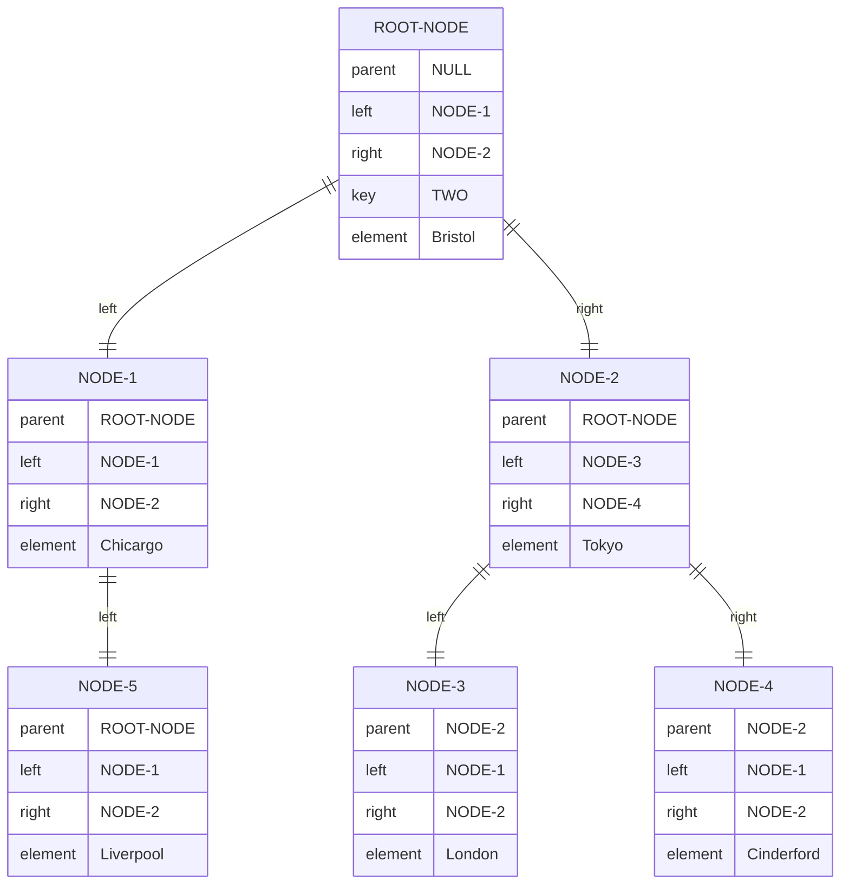
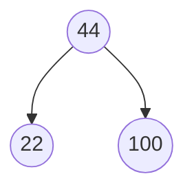

A [[Binary Search Tree]] is a [[Binary Tree]] used to store information, each terminal node in a [[Binary Search Tree]] contain a [[Key-value pair]] (*k, v*) with the keys stored on the left of the subtree being less then *k* and the ones on the right being greater.

