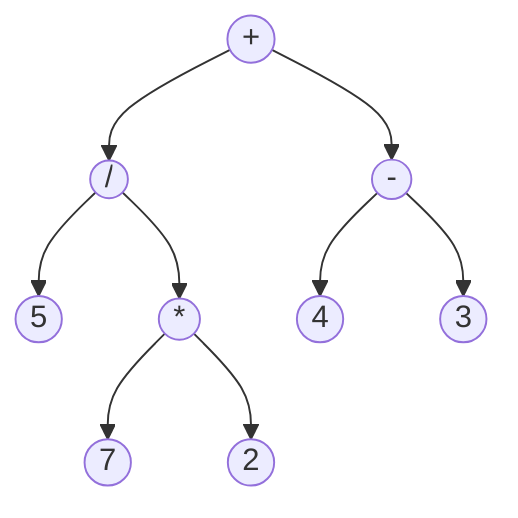

A [[Binary Tree]] is an ordered [[Tree]] where each node can only carry a maximum of two children nodes. All children of a given node are labelled *left* and *right* with all operations favouring the the *left* most child before proceeding onto the right.
Some uses of [[Binary Tree]]'s include:
* Mathematic operations: being very useful in the ordering and structuring of given problems, breaking down a given instruction sets into branches to be solved fractally with the given parent being an operator.

* Coding Compilation: being able to do the above, turning complex human readable instructions into linear machine readable, machine code.

