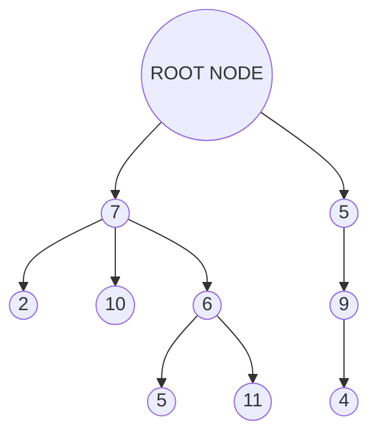

a [[Tree]] (T) is a set of nodes storing elements such that the nodes have a parent child relationship. If a given tree is non-empty it contains a root node, this is the parent to all other nodes in the tree.

